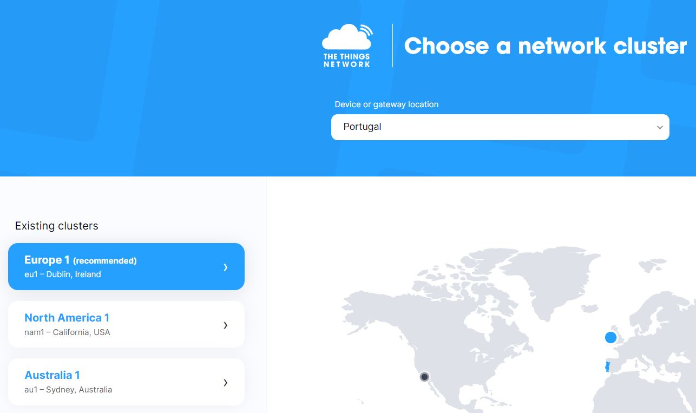
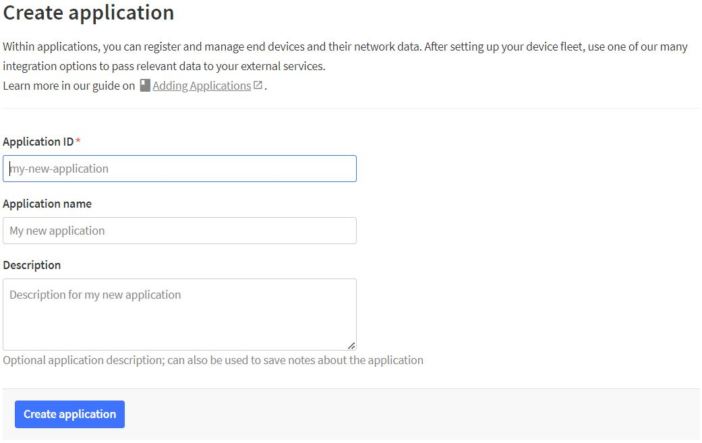
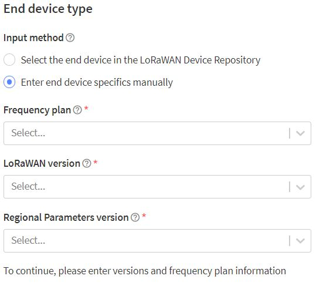
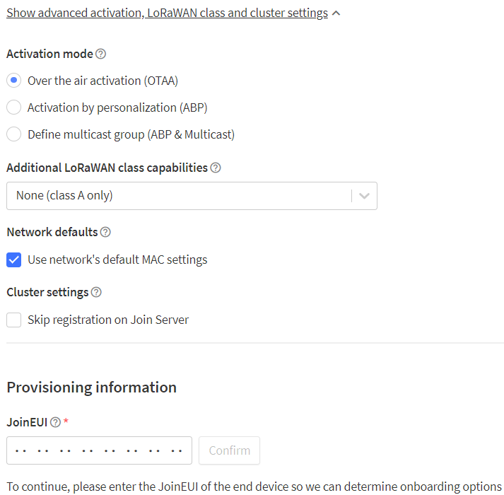

# Configuração do ambiente de desenvolvimento

## Registo na TTN

Para utilizar a TTN, é necessário registrar uma conta na plataforma. O registo é gratuito e permite criar aplicativos e adicionar dispositivos à TTN. Navegue até o “Console” abaixo do nome da conta e escolha um network cluster. 

Um Network cluster na TTN é uma organização ou grupo de utilizadores responsável por configurar e manter uma rede de gateways LoRaWAN em uma área geográfica específica. O papel destes clusters são importantes para a expansão da cobertura da TTN, pois permitem que mais áreas sejam atendidas pela rede. Ao criar um network cluster, os utilizadores comprometem a instalar e manter gateways em locais estratégicos dentro da região, garantindo uma cobertura adequada para os dispositivos LoRaWAN. É utilizado o cluster Europe 1 e o device or gateway location em Portugal. Na opção de Go to applications é possível adicionar a aplicação com o objetivo de gerir dispositivos e visualizar dados na rede.

O processo de registo do dispositivo pode variar dependendo do tipo de dispositivo e das opções disponíveis, mas geralmente envolve as seguintes etapas:

- Obter as informações de autenticação do dispositivo: O dispositivo deve ter um conjunto de informações de ativação, como um AppEUI (Endereço Único da Aplicação) e um DevEUI (Endereço Único do Dispositivo). Essas informações podem ser fornecidas pelo fabricante do dispositivo ou geradas pela própria plataforma da TTN.TODO: ser mais específico.

- Adicionar o dispositivo na aplicação: Na aplicação da TTN, clique em Register end device (Registrar dispositivo). Na secção End device type(tipo de dispositivo) insira manualmente as características do dispositivo que vai ser utilizado, tal como Frequency plan, LoRaWAN version, modo de ativação ABP (Activation by Personalization) ou OTAA (Over-The-Air Activation), etc.

TODO: ACTIVATION BY PERSONALIZATION VS OVER THE AIR ACTIVATION
Qual foi o modo escolhido e qual a vantagem e desvantagens?

Ao registar vai ser possível ter uma visão geral do dispositivo na aplicação na qual pode visualizar todas as informações sobre o dispositivo. Esta informação será útil para a comunicação do dispositivo com a plataforma TTN

## Dispositivo TTGO T-Beam
- Fazer o Download do driver da [silicon labs](https://www.silabs.com/developers/usb-to-uart-bridge-vcp-drivers?tab=downloads) para conectar o TTGO T-Beam ao computador. Selecione o CP210x Universal Windows Driver, v11.2.0, 10/21/2022 e faça a extração do .zip para uma pasta permanente. Esta configuração permite que o computador reconheça o dispositivo na porta USB. 
- Conectar o dispositivo ao computador 
- Ir a "Device Manager"
- Selecionar o tipo de dispositivo Portas (COM e LPT), Silicon Labs CP210x USB to UART Bridge (COM4), da fabricante Silicon Labs.
- Right click no dispositivo selecione "Properties" vá até "Driver", "Update driver", procure no computador e selecione a pasta com o conteúdo extraído anteriormente.
- Download e instale o [Pycom firmware updater](https://docs.pycom.io/updatefirmware/device/).
- No Pycom Upgrade Communication Flash from local file e selecione [TBEAMv1-1.20.2.r4.tar.gz](https://github.com/nunomcruz/pycom-micropython-sigfox/releases/tag/v1.20.2.r4-tbeamv1) pelo professor Nuno Cruz. Este é um projeto MicroPython, que visa colocar uma implementação do Python 3.x em microcontroladores e small embedded systems. Pode encontrar no site oficial em [micropython](https://micropython.org/).
- No Visual Studio Code instale [PyMakr extension](https://marketplace.visualstudio.com/items?itemName=pycom.Pymakr). Esta é uma poderosa ferramenta de desenvolvimento para o ambiente de programação Visual Studio Code, projetada especificamente para programar dispositivos de IoT (Internet das Coisas) em placas como o TTGO T-Beam. A extensão PyMakr simplifica o processo de desenvolvimento, permitindo que os programadores escrevam, editem e enviem código diretamente para os dispositivos conectados.
