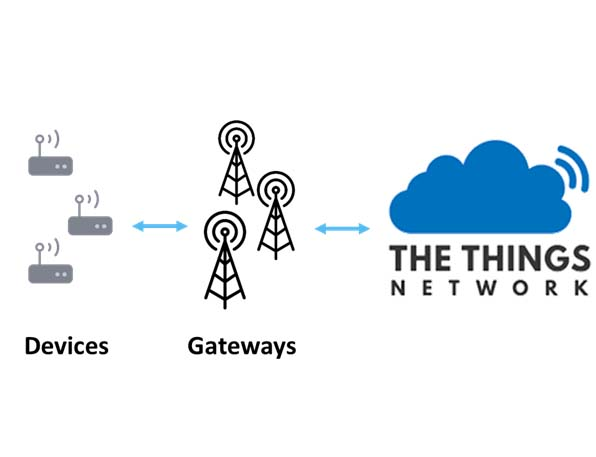

# 4.1 The Things Network (TTN)
## 4.1.1 Descrição e importância da TTN
A The Things Network (TTN) é uma plataforma de rede global, aberta e gratuita projetada para suportar a comunicação de dispositivos IoT por meio do protocolo de rede LoRaWAN. 

A TTN baseia-se em servidores cloud que conecta dispositivos e gateways LoRaWAN no mundo todo. A missão da TTN é construir uma rede de IoT, onde os utilizadores podem construir, manter e gerir a plataforma. A ideia é que qualquer pessoa possa instalar um gateway e contribuir para a expansão da cobertura da rede. Ao conectar dispositivos à TTN, os utilizadores tem acesso a uma rede de comunicação segura, escalável e de baixo custo. A TTN oferece recursos como autenticação de dispositivos, gestão de dados e integração com aplicativos e serviços externos.

A utilização da TTN é especialmente relevante para projetos de IoT que exigem uma cobertura ampla e de alcance global. Com a TTN, os programadores podem aproveitar uma rede estabelecida e colaborativa, evitando a necessidade de construir e manter sua própria plataforma. Além disso, a TTN oferece suporte a diversas aplicações e casos de uso, desde gestão ambiental, agricultura inteligente e até cidades inteligentes.

## 4.1.3 Arquitetura da TTN

A arquitetura da TTN oferece uma plataforma escalável e flexível para a comunicação de dispositivos através do protocolo de rede Low Power Wide Area Networking LoRaWAN.

Device (Dispositivo) - Um dispositivo que include um LoRa Modem, envie dados para gateways habilitados com o protocolo de rede LoRaWAN, tem um identificador globalmente exclusivo DevEUI e um identificador exclusivo de rede DevAddr. No dispositivo é possível escolher entre os seguintes modos de ativação por Over The Air Activation (OTAA) e/ou Activation By Personalization (ABP).

Gateway - Os gateways são os pontos de acesso ao protocolo de rede LoRaWAN. São responsáveis por receber as mensagens dos dispositivos e encaminhar para o Network Server da TTN. Os gateways comunicam-se com os dispositivos utilizando o protocolo LoRaWAN.

Network Server (Servidor de rede) - O Network Server também conhecido com sistema de back-end é o componente central da arquitetura da TTN. Ele é responsável pela gestão, registo e autenticação dos dispositivos, controla o acesso à rede, encaminha as mensagens entre os dispositivos e as aplicações e aplica as políticas de segurança. O Network Server também coordena os gateways para garantir a receção correta das mensagens dos dispositivos.

Application Server (Aplicação servidora) - O Application Server gere a camada de aplicação da LoRaWAN incluindo o processamento das mensagens recebidas dos dispositivos e pelo envio das mensagens de volta para os dispositivos.

Consola da TTN: A Consola da TTN é a interface web fornecida pela plataforma. Com ela os utilizadores podem gerir as aplicações, visualizar informações sobre os dispositivos, configurar gateways, analisar o tráfego de dados e realizar outras tarefas administrativas relacionadas à rede TTN.

## 4.1.2 Registo na TTN
Para utilizar a TTN, é necessário registrar uma conta na plataforma. O registo é gratuito e permite criar aplicativos e adicionar dispositivos à TTN. Navegue até o “Console” abaixo do nome da conta e escolha um network cluster. 

Um Network cluster na TTN é uma organização ou grupo de utilizadores responsável por configurar e manter uma rede de gateways LoRaWAN em uma área geográfica específica. O papel destes clusters são importantes para a expansão da cobertura da TTN, pois permitem que mais áreas sejam atendidas pela rede. Ao criar um network cluster, os utilizadores comprometem a instalar e manter gateways em locais estratégicos dentro da região, garantindo uma cobertura adequada para os dispositivos LoRaWAN. É utilizado o cluster Europe 1 e o device or gateway location em Portugal. Na opção de Go to applications é possível adicionar a aplicação com o objetivo de gerir dispositivos e visualizar dados na rede.

O processo de registo do dispositivo final pode variar dependendo do tipo de dispositivo e das opções disponíveis, mas geralmente envolve as seguintes etapas:

- Obter as informações de autenticação do dispositivo: O dispositivo final deve ter um conjunto de informações de ativação, como um AppEUI (Endereço Único da Aplicação) e um DevEUI (Endereço Único do Dispositivo). Essas informações podem ser fornecidas pelo fabricante do dispositivo ou geradas pela própria plataforma da TTN.TODO: ser mais específico.

- Adicionar o dispositivo na aplicação: Na aplicação da TTN, clique em Register end device (Registrar dispositivo final). Na secção End device type(tipo de dispositivo final) insira manualmente as características do dispositivo que vai ser utilizado, tal como Frequency plan, LoRaWAN version, modo de ativação ABP (Activation by Personalization) ou OTAA (Over-The-Air Activation), etc.

TODO: ACTIVATION BY PERSONALIZATION VS OVER THE AIR ACTIVATION
Qual foi o modo o escolhido e qual a vantagem e desvantagens?

Ao registar vai ser possível ter uma visão geral do dispositivo na aplicação na qual pode visualizar todas as informações sobre o dispositivo. Esta informação será útil para a comunicação do dispositivo com a plataforma TTN

# 4.2 Protocolo de rede LoRaWAN
##	4.2.1 Visão geral do protocolo de rede LoRaWAN
##	4.2.2 Benefícios e aplicabilidade do LoRaWAN no projeto

# 4.3 Dispositivo TTGO T-Beam
##	4.3.1 Visão geral do dispositivo TTGO T-Beam
##	4.3.2 Características e funcionalidades do TTGO T-Beam
##	4.3.3 Seleção do TTGO T-Beam para o projeto

# 4.4 Desenvolvimento da aplicação Android
##	4.4.1 Descrição da aplicação Android
##	4.4.2 Conexão via BLE com o dispositivo TTGO T-Beam
##	4.4.3 Integração da aplicação Android com a TTN

# 4.5 Desenvolvimento da aplicação web
##	4.5.1 Descrição da aplicação web
##	4.5.2 Funções e interações com o TTGO T-Beam e a TTN
##	4.5.3 Tecnologias utilizadas no desenvolvimento da aplicação web
