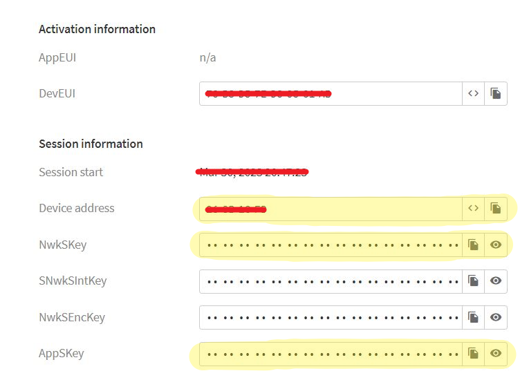
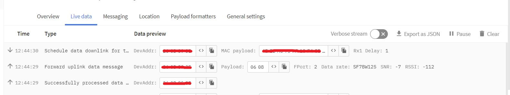

# LILYGO® TTGO T-Beam v1.0 (868 MHz) AND TTN (The Things Network)
## LoRaWAN data transmission.

This Python code uses LoRaWAN technology to send data wirelessly over a LoRa network using ABP (Activation By Personalisation) authentication method. The LoRa module is initialized in LoRaWAN mode, and the region is set to EU868. ABP authentication parameters are created, including Device Address, NwkSKey, and AppSKey.


```python
import time
import socket
import binascii
import struct
from network import LoRa
# Initialise LoRa in LORAWAN mode.
# Please pick the region that matches where you are using the device:
# Europe = LoRa.EU868
lora = LoRa(mode=LoRa.LORAWAN, region=LoRa.EU868)
def join_lora(force_join = False):
    '''Joining The Things Network '''
    # restore previous state
    if not force_join:
        lora.nvram_restore()
    if not lora.has_joined() or force_join == True:
        # create an ABP authentication params
        # your application Device address
        dev_addr = struct.unpack(">l", binascii.unhexlify('11111111'))[0]
        # your application NwkSKey
        nwk_swkey = binascii.unhexlify('11111111111111111111111111111111')
        # your application AppSKey
        app_swkey = binascii.unhexlify('11111111111111111111111111111111')
        # join a network using ABP (Activation By Personalisation)
        lora.join(activation=LoRa.ABP, auth=(dev_addr, nwk_swkey, app_swkey))
        # wait until the module has joined the network
        while not lora.has_joined():
            time.sleep(2.5)
            print('Not yet joined...')
        # saving the state
        lora.nvram_save()
        # returning whether the join was successful
        if lora.has_joined():
            return True
        else:
            return False
    else:
        return True
# joining TTN
join_lora(True)
# wait until the module has joined the network
while not lora.has_joined():
    time.sleep(2.5)
    print('Not yet joined...')
# create a LoRa socket
s = socket.socket(socket.AF_LORA, socket.SOCK_RAW)
# set the LoRaWAN data rate
s.setsockopt(socket.SOL_LORA, socket.SO_DR, 5)
# make the socket non-blocking
s.setblocking(False)
# send some data
s.send(bytes([0x06,0x08]))
```

After joining the network, a LoRa socket is created, and the LoRaWAN data rate is set. The socket is made non-blocking, and the code sends some data in bytes ([0x06, 0x08]).



In summary, this code establishes a connection to a LoRaWAN network and sends some data wirelessly over the network using a LoRa module.