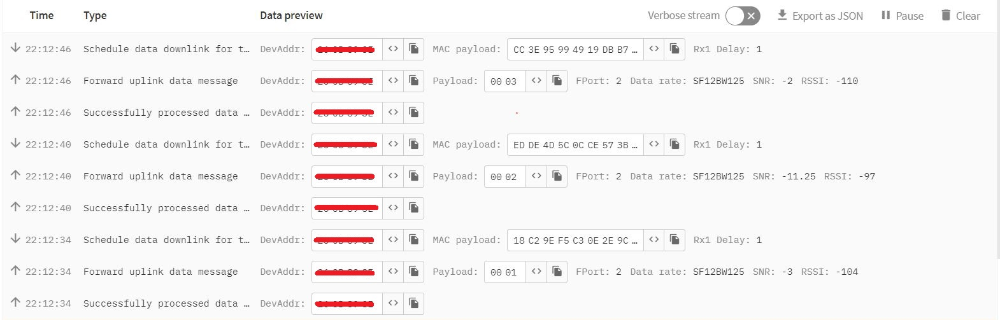

# LILYGO® TTGO T-Beam v1.0 (868 MHz) AND TTN (The Things Network)
## LoRaWAN data transmission.

This is written in MicroPython and is used to join a LoRaWAN network send and receive data over the network using the LoRa radio module with ABP (Activation By Personalisation) authentication method. The LoRa module is initialized in LoRaWAN mode, and the region is set to EU868. ABP authentication parameters are created, including Device Address, NwkSKey, and AppSKey.


```python
from network import LoRa
import socket
import binascii
import struct

# Initialise LoRa in LORAWAN mode.
# Please pick the region that matches where you are using the device:
# Europe = LoRa.EU868
lora = LoRa(mode=LoRa.LORAWAN, region=LoRa.EU868)

# create an ABP authentication params
dev_addr = struct.unpack(">l", binascii.unhexlify('11111111'))[0]
nwk_swkey = binascii.unhexlify('11111111111111111111111111111111')
app_swkey = binascii.unhexlify('11111111111111111111111111111111')

# join a network using ABP (Activation By Personalization)
lora.join(activation=LoRa.ABP, auth=(dev_addr, nwk_swkey, app_swkey))

# create a LoRa socket
s = socket.socket(socket.AF_LORA, socket.SOCK_RAW)

# set the LoRaWAN data rate
s.setsockopt(socket.SOL_LORA, socket.SO_DR, 5)

# make the socket non-blocking
# (because if there's no data received it will block forever...)
s.setblocking(False)

# make the socket blocking
# (waits for the data to be sent and for the 2 receive windows to expire)
s.setblocking(True)

# send some data
s.send(bytes([0x01]))

s.setblocking(False)

# get any data received (if any...)
data = s.recv(64)
print(data)
```

The example attempts to get any data received after sending the some data. Keep in mind that the Gateway might not be sending any data back, therefore we make the socket non-blocking before attempting to receive, in order to prevent getting stuck waiting for a packet that will never arrive.



In summary, this code establishes a connection to a LoRaWAN network, receives and sends some data wirelessly over the network using a LoRa module.

## Resources
- [Pycom and LoRaWAN](https://docs-mk2.readthedocs.io/en/latest/firmwareapi/pycom/network/lora/)
- [Lora ABP](https://docs.pycom.io/tutorials/networks/lora/lorawan-abp/)
- [Lora OTAA](https://docs.pycom.io/tutorials/networks/lora/lorawan-otaa/)
