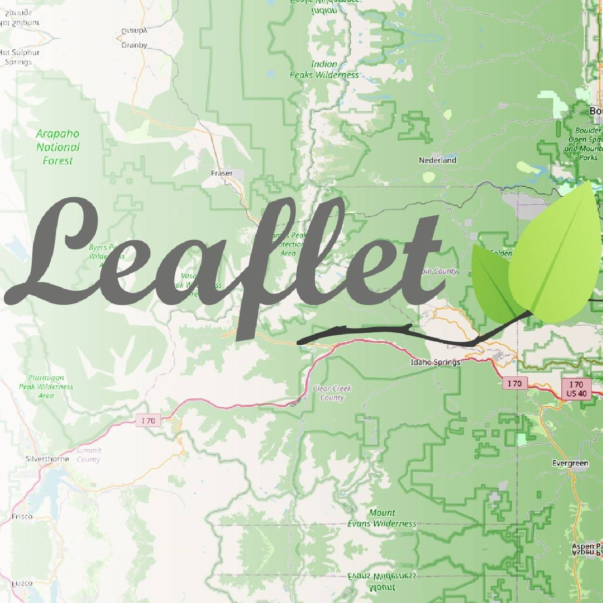
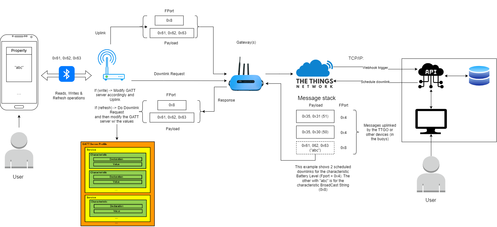

# SeaSpot ⚓
- An infrastructure that facilitidates the communication and management of objects using LoRa and an Android Device. 
- It's also my [Bachelor's degree final project (Project and Seminar) in ISEL](https://www.isel.pt/curso/licenciatura/licenciatura-em-engenharia-informatica-e-de-computadores)

## Repository contents 📁
- **App** -> The [Android Studio](https://developer.android.com/studio) project for our Android application
- **Docs** -> A folder containing all the documentation about the project
- **Pycom** -> All the MicroPython files to install the scripts that will be running in the device, which should be flashed into the device via the Pycom ecosystem/interface (with Pymakr)
- **WebApp** -> Contains the back-end

## Technologies 🖥️

<table>
  <tr>
    <th>Android</th>
    <th>Compose</th>
    <th>Kotlin</th>
    <th>Bluetooth</th>
    <th>LoRa</th>
    <th>Things Network</th>
    <th>Pycom</th>
    <th>MicroPython</th>
    <th>ExpressJS</th>
    <th>NodeJS</th>
    <th>JavaScript</th>
    <th>Bootstrap</th>
    <th>Handlebars</th>
    <th>Elasticsearch</th>
    <th>Leaflet</th>
  </tr>
  <tr>
    <td></td>
    <td></td>
    <td></td>
    <td></td>
    <td></td>
    <td></td>
    <td></td>
    <td></td>
    <td></td>
    <td></td>
    <td></td>
    <td></td>
    <td></td>
    <td></td>
    <td></td>
  </tr>
</table>

## Full Video demo 🎥

## Architecture Diagram 📋

## VSC extensions recommended 🔌 
- [Pymakr](https://marketplace.visualstudio.com/items?itemName=pycom.Pymakr)
- [vscode-icons](https://marketplace.visualstudio.com/items?itemName=vscode-icons-team.vscode-icons)

## Initial project proposal to students (PT) ✍️

As redes `IoT`(Internet of Things) têm, atualmente, um importante papel no transporte de dados provenientes de sensores ou de outros dispositivos. Uma das tecnologias mais popular atualmente é a [LoRa](https://www.semtech.com/lora/what-is-lora), com aplicações transversais nas mais diferentes áreas. Além de diversas vantagens, a tecnologia `LoRa` apresenta distâncias de cobertura muito superiores às conseguidas pelas redes tradicionais, sendo possível efetuar coberta de regiões sem qualquer tipo de cobertura de rede móvel celular. Uma das aplicações deste tipo de tecnologia é a cobertura marítima, em distâncias muito superiores. No entanto, a comunicação através de dispositivos móveis nestes casos é vedada, pela não existência de cobertura de rede celular terrestre. Pretende-se desenvolver um sistema, composto por sistema central e aplicação cliente móvel, que disponibilize num dispositivo móvel convencional uma aplicação de comunicação através de rede `LoRa`, para usar a bordo de embarcações de pesca, em regiões afastadas da costa. Para isso, existirá um dispositivo a bordo da embarcação que assegurará a comunicação através de uma rede [LoRaWAN](https://lora-alliance.org/about-lorawan/) e efetuará a conversão para [BLE](https://www.bluetooth.com/bluetooth-resources/intro-to-bluetooth-low-energy/), permitindo que a aplicação móvel envie e receba mensagens de estado e disponibilize um serviço de localização num mapa ao utilizador.

O sistema será assim composto por três componentes: 
- Sistema central de gestão de comunicação; 
- Dispositivo para conversão `LoRa` / `BLE`;
- Aplicação Móvel para Android.

## Developed project (resume) 🛠️
The project consists of a communication and tracking system that allows a user with an Android phone to read and write properties from an IoT device (in this case a LILYGO TTGO T-Beam) via Bluetooth Low Energy (BLE). In turn, this device, that was programmed with MicroPython, communicated  via LoRa (a low-power & long-range radio communication technique) to a LoRaWAN network, hosted by The Things Network (TTN), to register the location of the device (via it's GPS) along with the latest messages being sent by the user or automatically by the device. These write operations trigger a Webhook (by TTN) which communicates with our back-end, in the form of a RESTful API, to store this information in our Elasticsearch database. For the back-end, we used the ExpressJS framework and Handlebars to generate the HTML (via server-side rendering). To expose our back-end to the TTN's Webhook in a simple way, we used ngrok to expose a public URL address, instead of deploying the back-end to a cloud provider. The front-end allows user's to consult and filter the list of messages. Each message has the location of the device at the time it was sent. And the device's page displays the latest location. Both of these pages display an interactive map in the browser. The Android application was programed with Kotlin and Jetpack Compose.

## Authors:
- Paulo Rosa 44873
- Raul Santos 44806
- Tiago Pilaro 46147

## Advisors
- José Simão
- Nuno Cota
